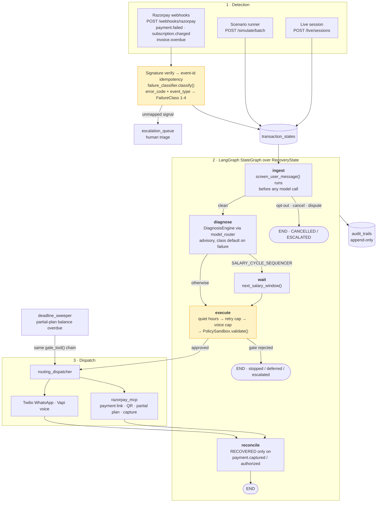

<div align="center">

# 🪙 Recova

### Revenue recovery that knows when to stop.

An AI agent that detects revenue at risk, diagnoses why it failed, runs a bounded intervention, and stops the moment policy says stop.

**[Live console](https://recova-v1.vercel.app/console)** · **[API docs](https://recova-production-4531.up.railway.app/docs)** · **[Real Razorpay capture](#-proof-on-live-razorpay-infrastructure)**

**Docker images:** [recova-backend](https://hub.docker.com/r/abhayk000/recova-backend) · [recova-frontend](https://hub.docker.com/r/abhayk000/recova-frontend)

<br/>


</div>

---

## Architecture

A failure signal enters from Razorpay, is deterministically classified, and is then driven through a LangGraph `StateGraph`. The model advises inside the graph; it never dispatches. Every outbound action clears four deterministic gates first.



`OrchestratorDeps {db, diagnosis, sandbox, dispatch, clock}` is injected into the graph, so the whole engine runs offline in tests with a fixed clock.

---

## Capabilities

| Capability | Implementation |
|---|---|
| **Ingests live gateway signals** | Signature-verified Razorpay webhooks with event-id idempotency (`processed_events`) |
| **Classifies failures deterministically** | `failure_classifier.classify()` maps error codes to a locked 4-class taxonomy; an unmapped signal escalates rather than defaulting |
| **Diagnoses root cause** | `diagnosis_service` returns `{root_cause, recommended_playbook, confidence}`; unknown playbooks coerce to the class default |
| **Routes model spend per call** | `model_router` picks provider and capability tier per call; stakes ≥ ₹25,000 or guardrail proximity raise the tier automatically |
| **Recovers via six intervention types** | WhatsApp, voice, payment link, QR code, partial-payment plan, fee waiver |
| **Negotiates partial payments** | `OFFER_PARTIAL_PLAN` gated by `allow_partial_payment` and `min_partial_payment_pct`; a part payment books against `balance_due_minor` and does not close the case |
| **Chases its own deadlines** | `deadline_sweeper` reconciles first, then follows up on an outstanding balance through the same gate chain, so quiet hours still apply |
| **Tracks upcoming money on a calendar** | `/console/subscriptions` plots next debit dates and invoice due dates by status, backed by `GET\|POST /subscriptions` and `/invoices` |
| **Speaks Hindi and English** | Transient Vapi assistant configs built per call; opt-out matching covers EN and Hinglish (`band karo`, `mat bhejo`, `rok do`) |
| **Executes real payments** | Private Razorpay MCP server over Docker/stdio, allowlisted tool surface, never exposed to the model |
| **Stops itself on 8 named rules** | `constants.StoppingRule`, each emitting a structured audit row counted in metrics |
| **Cannot be talked past a guardrail** | `policy_guard.py` and `compliance_rules.py` are model-free Python; the LLM proposes, the gates decide |
| **Runs concurrently** | asyncio worker pool, one SQLite session per worker, WAL mode: 200 cases in ~3.1s, ~65 cases/sec, p95 ~280ms at 8 workers |
| **Forecasts its own outcome** | Beta-Bernoulli posteriors per class × playbook × channel with a 95% band, updated from observed outcomes |
| **Proves every decision** | Append-only audit trail, single writer, structured payloads, CSV export |

---

## The core idea

Every run ends in one generated line:

> *Recova recovered **‹measured ₹›** of **‹at-risk ₹›** across **‹N›** cases, **‹e›** escalated to a human, **‹s›** stopped by policy.*

Every value is computed from that run. Nothing is stored or hardcoded. You supply a scenario, press Run, and N cases stream through the same LangGraph engine that runs in production.

The recovered figure is a *function of the guardrails*. Change **retries already used** from `1` to `3` in the scenario form and press Run: those mandates have spent all three RBI-permitted auto-debit retries, the engine refuses a fourth, and the recovered figure collapses. Set it back and the money returns.

---

## Try it in 60 seconds

| | |
|---|---|
| Console | <https://recova-v1.vercel.app/console> |
| API + docs | <https://recova-production-4531.up.railway.app/docs> |

Each preset exposes a different guardrail:

| Preset | Guardrail on screen |
|---|---|
| Month-end mandate crunch | `TRAI_QUIET_HOURS` defers outbound contact at 21:40, exempts the channel-less retry |
| Receivables chase | `DISPUTE_FREEZE` escalates aged B2B disputes to a human |
| Mixed book, tight policy | `PolicySandbox` with discount cap at zero and voice off; forbidden actions escalate |
| Retry budget exhausted | `RBI_MAX_RETRIES` stops the engine before a fourth debit |

---

## Proof on live Razorpay infrastructure

A single recovery run captured in Razorpay Test Mode. The agent diagnosed a Class 1 failure, cleared every gate, and asked the MCP adapter to mint a payment link, which Razorpay created, hosted, and later reported as `captured`.

<table>
<tr>
<td width="34%"></td>
<td width="33%"></td>
<td width="33%"></td>
</tr>
</table>

1. **WhatsApp nudge** carrying a Razorpay-hosted `rzp.io` short link, sent only after `screen_user_message()`, quiet hours, retry cap, voice cap and `PolicySandbox.validate()` all passed. The closing *"Payment received"* line is the engine reconciling the webhook.
2. **Razorpay checkout** with the reference line *"Payment recovery for `sim_live_3b0_custom_0000`"*, the agent run id passed straight into `create_payment_link`.
3. **`pay_TYcWqaZdJQwZYA` captured.** The `payment.captured` event becomes a `RECOVERED` transition plus an audit row.

**Reproduce:** set `RAZORPAY_KEY_ID`, `RAZORPAY_KEY_SECRET` and `RAZORPAY_WEBHOOK_SECRET` in `Backend/.env`, start the MCP server from `.Agents/mcp.json`, open `/live`, pick a Class 1 case and reply to the nudge.

---

## The four failure classes

The engine routes on a locked 1-4 taxonomy (`constants.FailureClass`). Each class profile is shared by the seeder and the live runner, so a seeded case and a live case never tell two different stories.

| Class | Name | Root cause | Playbook | Action → Channel | Prior* |
|:---:|---|---|---|---|:---:|
| **1** | Issuer / Network Timeout | `ISSUER_LATENCY_SPIKE` | `REROUTE_RAIL` | `GENERATE_PAYMENT_LINK` → Link | Beta(7, 3) |
| **2** | Checkout Authentication Drop | `OTP_SESSION_EXPIRED` | `UPI_AUTOPAY_NUDGE` | `SEND_WHATSAPP` → WhatsApp | Beta(5.5, 4.5) |
| **3** | Recurring Mandate Failure | `SALARY_CYCLE_MISMATCH` | `SALARY_CYCLE_SEQUENCER` | `RETRY_CHARGE` → no contact | Beta(6.5, 3.5) |
| **4** | B2B Invoice Aging | `BUYER_APPROVAL_DELAY` | `P2P_TRACKER` | `SEND_WHATSAPP` → WhatsApp | Beta(4.5, 5.5) |

<sub>*Starting belief about pay-through rate, read as pseudo-counts. Displaced by observed outcomes as the engine runs.</sub>

Two distinctions the copy never blurs: `CANCELLED` (a compliant stop) versus `FAILED` (retries exhausted), and a *failed payment* (the problem) versus a *failed recovery* (our attempt).

---

## Guardrails and stopping rules

Eight named rules in `constants.StoppingRule`, enforced in two places.

| Rule | Enforced in | Behaviour |
|---|---|---|
| `EXPLICIT_CANCEL` | `screen_user_message()` → `ingest` | Terminate to `CANCELLED` |
| `OPT_OUT` | same | Terminate to `CANCELLED`, beats dispute |
| `DISPUTE_FREEZE` | same | Escalate, do not terminate |
| `RBI_MAX_RETRIES` = 3 | `retry_cap_exceeded()` → `execute` | Hard regulatory cap |
| `TRAI_QUIET_HOURS` 20:00 to 09:00 IST | `is_within_quiet_hours()` → `execute` | Defers to `WAITING`, resumes 09:00. A channel-less auto-debit retry is exempt since TRAI governs outbound contact |
| `VOICE_ATTEMPT_CAP` = 2 | `voice_attempts_exhausted()` → `execute` | Stop voice, consider handoff |
| `NO_DOUBLE_CHARGE` | seeded outcome | Late settlement lands before a retry |
| `CROSS_DEVICE_COMPLETION` | seeded outcome | Customer paid on another device |

`compliance_rules.py` (Python) and `Frontend/src/lib/bounds.ts` (TypeScript) mirror each other: `RBI_MAX_RETRIES=3`, `VOICE_ATTEMPT_CAP=2`, `QUIET_HOURS_START=20`, `QUIET_HOURS_END=9`. Change one, change the other.

Escalation is a success of the guardrails, not a failure.

---

## The model-free boundary

Two files are load-bearing for the product claim and stay deterministic.

**`operations/policy_guard.py` → `PolicySandbox.validate()`** is the single gate every outbound action passes. In order: action in `allowed_actions`, channel in `allowed_channels`, partial-payment rules, `discount_pct` ≤ `max_discount_pct`, and for money-moving actions `amount_minor` ≤ `max_intervention_amount_minor`. `Decision.reason` strings are user-facing copy, surfaced verbatim and never rewritten by a model.

**`operations/compliance_rules.py`** does deterministic phrase matching (EN and Hinglish) for cancel, opt-out and dispute, plus the numeric caps.

`merchant_policy` is a single row (`id=1`) written only by a human operator. The conversational layer has no path to it. A simulation builds a scenario-scoped sandbox in memory instead of touching that row.

---

## The cost-aware LLM router

`operations/model_router.py` owns tier selection and provider failover. The recovery engine still owns every consequential decision.

Task floors: `CLASSIFY` and `DRAFT` start at nano, `DIAGNOSE` and `CONVERSE` at mini, `DECIDE` at full. A live `DRAFT` raises to mini. Stakes ≥ ₹25,000 raise one tier. Guardrail proximity (last retry, last voice attempt, discount near cap) raises one tier. OpenAI is tried first, Gemini on 429, missing key or transport error. An empty, refused, malformed or low-confidence response gets one stronger retry.

| Call site | Task | Batch | Live | Deterministic fallback |
|---|---|---|---|---|
| `diagnosis_service` | `DIAGNOSE` | mini, JSON mode | mini | Class default playbook, `root_cause="UNDIAGNOSED"`, confidence 0.0 |
| `message_drafter` | `DRAFT` | nano | mini | Hardcoded EN/HI template |
| `assistant_service` | `DECIDE` | full, JSON mode | full | `_fallback_parse()`, keyword matching, EN and Hindi |

Both SDKs are lazy imports, so a missing key never takes down the API. Function calling is explicitly disabled: no tool definitions are handed to any model. Batch paths pass `generate=None` deliberately, since N cases × one call each is the dominant cost and will hit rate limits mid-demo. Every routed response carries a `RouteDecision` with a plain-language reason, surfaced in the case panel and returned by `POST /router/explain` with no model call at all.

---

## The simulation engine

`application/simulation/` takes a scenario, expands it deterministically via `plan()`, projects a band via `probability.project()`, then streams N cases through the real LangGraph concurrently over SSE (`start`, `case`, `progress`, `complete`).

- **One source of truth.** The simulator drives the real engine through an endpoint rather than reimplementing rules in TypeScript, which would drift.
- **Isolation.** Simulated cases carry `metadata_json.simulation_run_id` and are excluded from `compute_metrics` and `list_transactions` by default. Four full runs left `GET /metrics` byte-identical.
- **Concurrency.** Each case gets its own Session opened and closed inside the worker, the graph runs via `to_thread`, SQLite runs in WAL with a busy timeout. The test suite went from 228s to 37s.
- **Authored cases.** Operator-written cases flow through the same `screen_user_message()` ingest gate, so a typed Hinglish opt-out is a real `OPT_OUT` decision. Scenario percentages never rewrite an authored case.
- **Triage without calling the model.** `simulation/triage.py` scores every planned case against the same raisers `model_router` uses, plus two ambiguity signals. The `complete` event reports `llm` candidates alongside the mutually exclusive lanes `closed · human · postponed · in_flight`, and `model_calls_saved`.

Measured: 200 cases in ~3.1s, ~65 cases/sec, p95 ~280ms, 8 workers.

---

## The projection model

`application/simulation/probability.py` is closed form, pure stdlib, and runs per case inside the worker pool. A Beta prior per (class × playbook × channel) sets the base rate, then a logistic adjustment in log-odds applies: amount −0.18 per ln-step above ₹5,000, quiet hours −0.55, retries used −0.45 each, days overdue −0.006 per day, channel retried −0.50. Leave-one-out contributions rank the drivers in percentage points, and the delta method carries the prior's uncertainty into a 95% band. A case blocked by a spent bound gets `p = 0`, because a bound is a wall and not a headwind.

The three figures in the `complete` event are not additive and must not be summed:

| Figure | Meaning | Source |
|---|---|---|
| `recovered_inr` | Cases the engine actually drove to `RECOVERED` | Measured |
| `projected_inr` + `[low, high]` | Expected value across the book, 95% band | Modelled, never presented as money that moved |
| `deferred_inr` | Cases in `WAITING` from quiet hours, neither won nor lost | Measured |

`observed_posteriors()` folds real completed, non-simulated outcomes back into the priors. GRRR lands between 4.8% and 29% depending on scenario, and the guardrails are what move it.

`operations/repayment_model.py` is a separate, deliberately opposite demo: a small logistic regression fit by gradient descent at import time, so the UI can show a learned decision surface and feature weights.

---

## The live session

`/live` runs one in-process `asyncio.Queue` per session (`operations/live_session.py`). The durable transaction, message, call, escalation and audit rows remain the record.

Each human turn runs `screen_user_message()` ahead of the model, so opt-outs and disputes cannot be overridden by an LLM. On a clean turn the model proposes a tool, the gates evaluate it, the decision card streams out showing which rule armed, and only an approved action reaches a channel. The customer's side is scripted; the engine's decisions are real code.

---

## Partial payments and the calendar

Not every recovery is all or nothing. A customer who cannot clear ₹4,200 today can often clear half of it, and the engine treats that as progress rather than a win.

**The policy gate.** `OFFER_PARTIAL_PLAN` is a first-class intervention, but `PolicySandbox.validate()` decides whether it may be offered at all. A merchant sets `allow_partial_payment` and `min_partial_payment_pct` (default 50). An offer below that floor is rejected with a user-facing reason (*"Partial payment 30% is below the 50% policy minimum"*) and escalates to a human instead of going out.

**The balance, not the case.** When an approved plan is dispatched, `payment_artifacts` mints the artifact with `accept_partial`, `first_min_partial_minor` and a `deadline`. A part payment reduces `balance_due_minor` in the case metadata. It does **not** mark the case `RECOVERED`: only a fully cleared balance, or a plain non-partial link, closes it. So a half-paid case stays open, visible and still owned by the engine.

**The follow-up loop.** `operations/deadline_sweeper.py` runs on an interval and picks up artifacts whose deadline has passed with a balance outstanding and no follow-up yet. Each tick:

1. **Reconciles first**, so a customer who paid in the meantime is never chased.
2. **Runs `agent_tools.gate_tool()`**, the same chain a model proposal runs. If TRAI quiet hours are in force the follow-up defers, `followed_up_at` stays null, and the next tick tries again.
3. **Drafts in EN or Hinglish**, persists the message, stamps `followed_up_at` and writes a `DEADLINE_FOLLOWUP` audit row.

A flaky tick is logged and dropped rather than taking the sweeper down.

**The calendar.** `/console/subscriptions` renders `CalendarGrid` over upcoming money from the merchant's side: subscription next-debit dates and B2B invoice due dates, each plotted by status.

| Category | Mandate status |
|---|---|
| Paid | `recovered` |
| Sent | `retrying` · `deferred` · `intervening` · `escalated` |
| Pending | everything else |

Clicking a date opens the case sheet. Operators add rows through `POST /subscriptions` (customer, plan, amount, next debit date, salary day) and `POST /invoices` (due date). Both write real `transaction_states` rows, so a subscription booked on the calendar is a case the engine can later pick up, not a separate ledger.

Related: when the `SALARY_CYCLE_SEQUENCER` playbook routes a Class 3 case to the `wait` node, `helpers.next_salary_window()` schedules the retry to the 1st of the applicable month, the universal salary-credit date, rather than to the per-customer salary day shown in the sheet.

---

## Voice recovery

`operations/voice_agent.py` builds a transient Vapi assistant config per call, personalised with customer name, amount, failure-class script opening and live guardrail state (discount cap, voice attempts remaining). `conversation_service.build_call()` supplies the scripted beats and `speech_format.speakable()` renders numbers and currency for TTS. Provider maps through the same router at full tier. Voice is capped at 2 attempts. Integrations: Vapi (web and telephony) and ElevenLabs (TTS), Hindi and English.

---

## The private Razorpay MCP

`integrations/razorpay_mcp.py` is the payment dispatch transport, not a tool surface.

The `DECIDE` prompt proposes from a closed 9-member `AgentTool` set: `SEND_WHATSAPP`, `VOICE_CALL`, `GENERATE_PAYMENT_LINK`, `GENERATE_QR_CODE`, `OFFER_PARTIAL_PLAN`, `OFFER_FEE_WAIVER`, `SCHEDULE_RETRY`, `HANDOFF_TO_HUMAN`, `STOP`. The last three are dispositions and never dispatch, which is why `AgentTool` is a separate enum from `InterventionAction`.

**Central invariant:** the model never sees the MCP tool list, and no MCP tool name may appear in a `DECIDE` prompt or reach `AgentTool`. Only after quiet hours, retry cap, voice cap and `PolicySandbox.validate()` pass does the adapter run, against an allowlist of `create_payment_link`, `create_payment_link_upi`, `create_qr_code`, `fetch_*` and `capture_payment`. The MCP SDK is a lazy import and the connection is process-local.

Config lives in `.Agents/mcp.json`, which runs `razorpay-mcp-server:latest` in Docker. Webhooks land at `POST /api/v1/webhooks/razorpay` with `processed_events` idempotency.

---

## The audit trail

`entities/audit_record.py` writes to `audit_trails`, append-only: `before_update` and `before_delete` SQLAlchemy listeners raise on any attempt to mutate history. The single writer is `operations/audit_service.py::record_audit()`.

Reasoning is captured as a structured payload rather than prose: `{root_cause, recommended_playbook, confidence}`, `{rule, resume_at}`, `{channel, action, sandbox_reason}`. `/console/audit` groups the trail by DAG node, filters and exports to CSV. `compute_metrics()` derives everything on read, so nothing is stored.

---

## Frontend

Next.js 16.3 App Router, React 19.2, TypeScript strict, Tailwind v4 (CSS-first, no config file). Runtime UI dependencies are `next`, `react`, `react-dom`, plus `framer-motion` and `@vapi-ai/web`. No shadcn, no Radix, no icon library.

| Route | Purpose |
|---|---|
| `/` | Scroll-driven landing narrative, papery light theme scoped to the route |
| `/console` | Scenario form and presets → run progress → projection panel → filterable case list → case sheet with bounds gauge, decision trace, probability breakdown, conversation, audit timeline |
| `/console/guardrails` | Stopping rules, escalation queue, policy editor with live sandbox |
| `/console/audit` | Audit trail grouped by node, filterable, exportable |
| `/console/subscriptions` | Calendar of next debit dates and invoice due dates, colour-coded by status, with an add-subscription form |
| `/live` | SSE session view: WhatsApp mockup and call stage |

`en.ts` is the source of truth for copy; `hi.ts` is typed as `Dictionary`, so a missing Hindi key fails the build. `amount_inr` is rupees, `*_minor` is paise, converted once at the boundary in `lib/format.ts`.

---

## API surface

All routers mount under `/api/v1`.

<details>
<summary><b>Full endpoint list</b></summary>

| Area | Endpoints |
|---|---|
| **Health** | `GET /health` |
| **Metrics** | `GET /metrics` · `GET /escalations` · `POST /escalations/{ticket_id}/resolve` |
| **Transactions** | `GET /transactions` · `GET /transactions/{id}` · `GET /transactions/{id}/conversation` · `GET /transactions/{id}/calls` · `POST /transactions/{id}/call/start` · `POST /transactions/{id}/messages` · `POST /transactions/{id}/messages/draft` · `POST /transactions/{id}/payment-link` · `GET /transactions/{id}/payment-link/status` · `POST /transactions/{id}/status` · `POST /transactions/{id}/note` · `GET /transactions/{id}/run` (SSE) · `POST /transactions/simulate` · `POST /transactions/recover-batch` · `GET /audit` |
| **Simulation** | `POST /simulate/batch` (SSE) · `GET /simulate/scenarios` · `POST /simulate/scenarios` · `DELETE /simulate/scenarios/{slug}` · `GET /simulate/runs` · `GET\|DELETE /simulate/runs/{run_id}` · `POST /simulate/prune` |
| **Live** | `POST /live/sessions` · `GET /live/sessions/{id}/stream` (SSE) · `POST /live/sessions/{id}/reply` · `POST /live/sessions/{id}/call/web` · `POST /live/sessions/{id}/turns` · `POST /live/sessions/{id}/agent/tool` · `GET /live/sessions/{id}/artifacts` · `POST /live/sessions/{id}/artifacts/check-status` · `POST /live/sessions/{id}/artifacts/{artifact_id}/simulate-pay` · `DELETE /live/sessions/{id}` |
| **Policy** | `GET /policy` · `PATCH /policy` · `POST /policy/validate` · `POST /policy/screen` |
| **Router** | `POST /router/explain` (no model call) |
| **Repayment model** | `POST /repayment/predict` · `GET /repayment/model` |
| **Trackers** | `GET\|POST /subscriptions` · `GET\|POST /invoices` |
| **Assistant** | `POST /assistant/chat` · `POST /assistant/tts` |
| **Stream** | `GET /stream/demo/{failure_class}` (SSE) |
| **Webhooks** | `POST /webhooks/razorpay` |
| **Admin** | `POST /admin/seed` |

</details>

`POST /admin/seed` truncates every table, bypassing the append-only guards via bulk delete. It fails closed: with `ADMIN_TOKEN` unset the route returns `404`, and with it set the request must carry a matching `X-Admin-Token` header compared in constant time. No client calls it.

---

## Tech stack

| Layer | Choices |
|---|---|
| **Orchestration** | LangGraph 1.2 `StateGraph`, injected `OrchestratorDeps` |
| **Backend** | FastAPI 0.141 · SQLAlchemy 2.0 · Pydantic 2.13 · Uvicorn · `uv` |
| **Storage** | SQLite in WAL mode (`recovery_engine.db`), Fernet encryption for `customer_contact` |
| **LLM** | OpenAI (`openai>=3.8`) with Google Gemini (`google-genai 2.20`) fallback, both lazy imports, function calling disabled |
| **Payments** | `razorpay 2.0`, private MCP server via `mcp>=1.12` over Docker/stdio |
| **Voice** | Twilio 9.11 (WhatsApp) · Vapi · ElevenLabs, Hindi and English |
| **Frontend** | Next.js 16.3 · React 19.2 · TypeScript strict · Tailwind v4 · Framer Motion · `@vapi-ai/web` |
| **Tests** | `pytest` (47 files, 377 passing in ~58s, almost all offline) · `vitest` |

---

## Getting started

**Prerequisites:** Python 3.12+, Node.js 20.9+, npm, [`uv`](https://docs.astral.sh/uv/), and Docker if you want the live Razorpay MCP.

### Backend

```bash
cd Backend
uv sync
uv run uvicorn application.server:app --reload --port 8000
```

API at <http://localhost:8000>, docs at `/docs`. SQLite `Backend/recovery_engine.db` is created on first run. The entry point is `application.server:app`, not `main.py`. Startup runs `init_db()`, prunes old simulation and live-session rows, and launches the deadline sweeper.

<details>
<summary>Without <code>uv</code></summary>

```bash
python3 -m venv .venv && source .venv/bin/activate
python -m pip install -r Backend/dependencies.txt
cd Backend
python -m uvicorn application.server:app --reload --port 8000
```
</details>

### Frontend

```bash
cd Frontend
npm ci
cp .env.example .env.local
npm run dev
```

Dashboard at <http://localhost:3000>. Point `NEXT_PUBLIC_API_BASE` at another backend if needed.

### Seeding (optional)

Open `/console`, pick a sample scenario and press Run: the run drives the real LangGraph and writes genuine audit rows. For a stored book instead:

```bash
# Backend/.env
ADMIN_TOKEN=pick-something-long

curl -X POST http://localhost:8000/api/v1/admin/seed -H "X-Admin-Token: pick-something-long"
```

### Environment variables

Runs locally on built-in defaults. Add to `Backend/.env` as needed:

| Var | For |
|---|---|
| `GEMINI_API_KEY` / `OPENAI_API_KEY` | LLM router, either works, both optional |
| `RAZORPAY_KEY_ID`, `RAZORPAY_KEY_SECRET`, `RAZORPAY_WEBHOOK_SECRET` | Razorpay and MCP |
| `ELEVENLABS_API_KEY`, `VAPI_API_KEY` | Voice |
| `TWILIO_ACCOUNT_SID`, `TWILIO_AUTH_TOKEN`, `TWILIO_API_KEY_SID`, `TWILIO_API_KEY_SECRET` | WhatsApp |
| `ENCRYPTION_KEY`, `LIVE_MODE` | Fernet key and whether channels actually dispatch |
| `ADMIN_TOKEN` | Enables `POST /admin/seed`. Unset means the route stays disabled |

---

## Testing

```bash
cd Backend && uv run pytest     # 377 passing in ~58s, almost all offline
cd Frontend && npm test         # vitest
```

The suite pins a fixed mid-morning IST clock. Without it, tests would start failing at 20:00 (quiet hours) and the seeder would produce a time-dependent batch.

---

## Repo layout

```
Recova/
├── Backend/
│   ├── application/
│   │   ├── server.py             entry point
│   │   ├── constants.py          FailureClass · StoppingRule · Playbook
│   │   ├── endpoints/            one router per surface
│   │   ├── entities/             SQLAlchemy ORM models
│   │   ├── workflow/             recovery_graph · workflow_nodes · workflow_state
│   │   ├── operations/
│   │   │   ├── failure_classifier.py  webhook signal to FailureClass
│   │   │   ├── model_router.py        provider + tier + RouteDecision
│   │   │   ├── policy_guard.py        model-free sandbox
│   │   │   ├── compliance_rules.py    model-free stopping rules
│   │   │   ├── diagnosis_service.py · message_drafter.py · assistant_service.py
│   │   │   ├── agent_tools.py         closed AgentTool set + gates
│   │   │   ├── payment_artifacts.py   links, QR, partial-plan balances
│   │   │   ├── deadline_sweeper.py    gated partial-payment follow-ups
│   │   │   ├── tracker_service.py     subscription and invoice calendar
│   │   │   ├── live_session.py · voice_agent.py · audit_service.py
│   │   │   └── repayment_model.py     demo learned model
│   │   ├── simulation/           scenario · probability · runner · triage · store
│   │   ├── integrations/         Twilio · Vapi · razorpay_mcp
│   │   └── configuration/        merchant_rules.json
│   └── test_suite/               47 pytest files
├── Frontend/
│   ├── src/app/                  landing · console · guardrails · audit · live
│   ├── src/components/           console/ · sim/ · live/ · story/
│   └── src/lib/                  api · types · format · bounds · i18n/
├── docs/proof/                   Razorpay capture screenshots
├── .Agents/                      agent docs and mcp.json
└── Progress.md                   status and decisions log
```

---

<div align="center">

**Recova** · detect, diagnose, intervene, bound, escalate, stop, audit, measure.

Any system can send more messages. Ours knows when to stop.

</div>
