<div align="center">

# 🪙 Recova

### Revenue recovery that knows when to stop.

An AI agent that **detects** revenue at risk, **diagnoses** why it failed, runs a **bounded** intervention, and **stops** the moment policy says stop — then shows you the receipt.

*Built for the Razorpay Buildathon — Track 03: AI Revenue Recovery.*

**[▶ Open the live console](https://recova-v1.vercel.app/console)** · **[🎬 Watch the 3-min demo](https://youtu.be/E8sgaEjsF3k)** · **[💳 Real Razorpay capture](#-proof-it-works-on-real-razorpay-infrastructure)** · **[✅ Track 03 map](#-track-03-requirement-by-requirement)**

<a href="https://youtu.be/E8sgaEjsF3k"></a>

<sub>The console, running. Or <a href="https://recova-v1.vercel.app/console">open it yourself</a> — nothing to install.</sub>

<br/>


[](https://recova-v1.vercel.app/console)
[](https://recova-production-4531.up.railway.app/docs)
[](https://youtu.be/E8sgaEjsF3k)

</div>

---

## 📑 Table of contents

| | | |
|---|---|---|
| [See it in 60 seconds](#-see-it-in-60-seconds) | [The core idea](#-the-core-idea) | [Proof on real Razorpay](#-proof-it-works-on-real-razorpay-infrastructure) |
| [The problem](#-the-problem-track-03) | [Track 03, requirement by requirement](#-track-03-requirement-by-requirement) | [The story](#-the-story-meena--shashank) |
| [What makes Recova different](#-what-makes-recova-different) | [The four failure classes](#-the-four-failure-classes) | [Architecture](#-architecture) |
| [The recovery decision graph](#-the-recovery-decision-graph) | [Guardrails & stopping rules](#-guardrails--stopping-rules-the-spine) | [The model-free boundary](#-the-model-free-boundary) |
| [The cost-aware LLM router](#-the-cost-aware-llm-router) | [The simulation engine](#-the-simulation-engine-the-console-produces-money-it-doesnt-report-it) | [The projection model](#-the-projection-model-measured--projected--deferred) |
| [The live theatre](#-the-live-theatre-sse) | [Hinglish voice recovery](#-hinglish-voice-recovery) | [The private Razorpay MCP](#-the-private-razorpay-mcp) |
| [The audit trail](#-the-audit-trail) | [Frontend](#-frontend-make-the-money-undeniable) | [API surface](#-api-surface) |
| [Tech stack](#-tech-stack) | [Getting started](#-getting-started) | [Testing](#-testing) |
| [Repo layout](#-repo-layout) | | |

---

## 🎯 The core idea

Every run ends in one generated, plain-language line of the form:

> *Recova recovered **‹measured ₹›** of **‹at-risk ₹›** across **‹N›** cases — **‹e›** escalated to a human, **‹s›** stopped by policy.*

Every value in it is computed from that run — the money is what the engine actually drove to `RECOVERED`, the counts come from the audit trail. **Nothing is stored or hardcoded.** You supply a scenario, press Run, and N cases stream through the same LangGraph engine that would run in production; the number you see is the number the code produced, and you can change the inputs and watch it move.

That is the whole point: *money recovered*, demonstrated live and falsifiable — not *revenue risk identified*.

---

## ⏱ See it in 60 seconds

Nothing to install. The console is deployed and the backend is live.

| | |
|---|---|
| 🖥 **Console** | <https://recova-v1.vercel.app/console> |
| ⚙️ **API + interactive docs** | <https://recova-production-4531.up.railway.app/docs> |
| 🎬 **3-minute walkthrough** | <https://youtu.be/E8sgaEjsF3k> |

**The judge path — four steps, about a minute:**

1. Open the console → preset **"Month-end mandate crunch"** → **Run**. 200 cases stream through the real LangGraph engine concurrently, in ~3.1s. The clock is pinned to 21:40 IST, so watch TRAI quiet hours defer every outbound channel while the salary-window retry still goes ahead.
2. Read the generated line: *Recova recovered **₹X** of **₹Y** across **N** cases — **e** escalated to a human, **s** stopped by policy.* Every number in it was produced by that run.
3. Open any case → the **bounds gauge** shows which limits are spent and which rule halts it next; the decision trace shows the code path that produced the reason, and the audit timeline shows the rows it wrote.
4. **Now falsify it.** In the scenario form, change **retries already used** from `1` to `3` and press Run again. Those mandates have now spent all three RBI-permitted auto-debit retries, so the engine refuses to attempt a fourth — and the recovered figure collapses. Set it back to `0` and the money returns.

> Step 4 is the one that matters. A number sitting in a database can't do that. The recovered figure is a *function of the guardrails*, and you can move it from the form and watch it change.

**Each preset is built to expose a different guardrail**, so clicking through all four tells the whole compliance story without filling in anything:

| Preset | The guardrail it puts on screen |
|---|---|
| **Month-end mandate crunch** | `TRAI_QUIET_HOURS` — defers outbound contact at 21:40, exempts the channel-less retry |
| **Receivables chase** | `DISPUTE_FREEZE` — an aged B2B book where disputes escalate to a human instead of automating |
| **Mixed book, tight policy** | `PolicySandbox` — discount cap at zero, voice switched off; forbidden actions escalate rather than dispatch |
| **Retry budget exhausted** | `RBI_MAX_RETRIES` — the engine stops itself rather than attempting a fourth debit |

---

## 💳 Proof it works on real Razorpay infrastructure

A single recovery run, captured live in **Razorpay Test Mode**. The agent diagnosed a Class 1 failure, cleared every guardrail, and asked the MCP adapter to mint a payment link — which Razorpay created, hosted, and later reported as `captured`. Nothing here is mocked: the link, the short URL, and the `pay_…` id all live on Razorpay's servers.

| # | What you're looking at | What it proves |
|:--:|------------------------|----------------|
| 1 | **The agent's WhatsApp nudge** — a Razorpay-hosted `rzp.io` short link, sent after `screen_user_message()` → quiet-hours → retry-cap → voice-cap → `PolicySandbox.validate()` all passed. The trailing *"Payment received — ₹4,200. Thank you!"* is the engine reconciling the webhook and closing the case as `RECOVERED`. | The full loop: guardrails → MCP dispatch → hosted link → capture → reconcile. |
| 2 | **The Razorpay checkout** the customer opens. Note the reference line — *"Payment recovery for `sim_live_3b0_custom_0000`"* — that string is the agent's run id, passed straight into the `create_payment_link` call. | The link was minted by our code path, not created by hand in the dashboard. |
| 3 | **`Payment Successful`** — Razorpay returns a genuine payment id (`pay_TYcWqaZdJQwZYA`) and timestamp. This is the `payment.captured` event that the webhook handler turns into a `RECOVERED` transition + audit row. | Money actually moved through the gateway; the "recovered" figure is a real capture. |

<table>
<tr>
<td width="34%">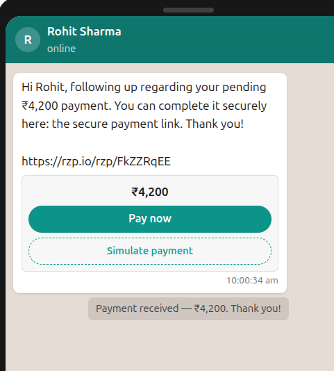</td>
<td width="33%">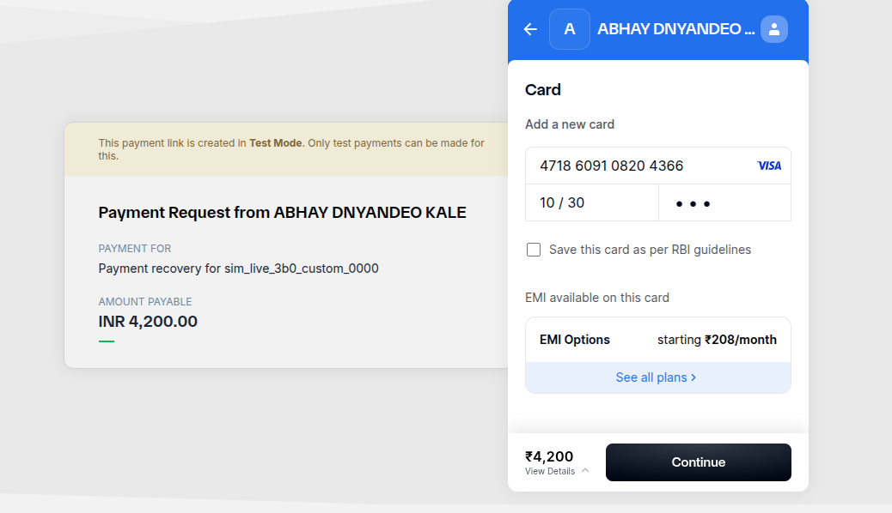</td>
<td width="33%">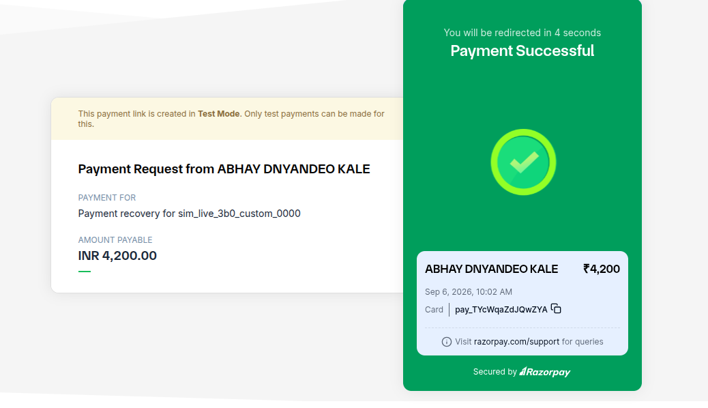</td>
</tr>
</table>

**Reproduce it:** set `RAZORPAY_KEY_ID` / `RAZORPAY_KEY_SECRET` (test keys) and `RAZORPAY_WEBHOOK_SECRET` in `Backend/.env`, start the MCP server from `.Agents/mcp.json`, open `/live`, pick a Class 1 case, and reply to the nudge. The decision card shows every gate that armed; the payment artifact carries the live `rzp.io` link; `razorpay.com/support` will confirm the `pay_…` id.

---

## 💸 The problem (Track 03)

Revenue rarely disappears in one clean break. It drains through a hundred cracks nobody can watch at once:

```text
Payment degrades      →  keeps failing        →  revenue at risk
Checkout initiated     →  abandoned at 3DS/OTP →  potential revenue lost
Subscription renews    →  auto-debit fails     →  recurring revenue at risk
Invoice hits due date  →  goes overdue         →  receivable unpaid
```

The brief asks for an agent that completes the **entire** progression — not just the first box:

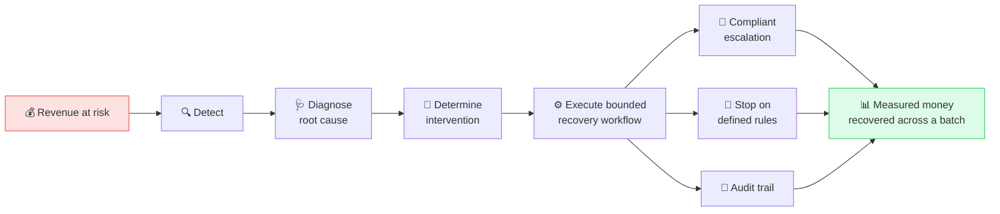

> The central outcome is **money recovered**, not *revenue risk identified*.

---

## ✅ Track 03, requirement by requirement

The brief asks for the whole progression, not just detection. Here is each clause, where it is implemented, and where you can watch it happen.

| The brief asks for | Implemented in | Watch it |
|---|---|---|
| **Detect** revenue at risk | `workflow_nodes.ingest` · four-class taxonomy in `constants.FailureClass` | `/console` case list, filterable by class |
| **Diagnose** the root cause | `operations/diagnosis_service.py` (routed, advisory; class default on failure) | case panel → diagnosis + confidence |
| **Determine** the intervention | `recovery_graph` playbook → action resolution | case panel → decision trace + `RouterChip` |
| **Execute** a *bounded* recovery workflow | `execute` node → quiet hours → retry cap → voice cap → `PolicySandbox.validate()` | `/live` decision card — every gate that armed |
| **Compliant escalation** | `DISPUTE_FREEZE` → `escalation_queue`, rejected actions escalate rather than dispatch | `/console/guardrails` → escalation queue |
| **Stop** on defined rules | 8 named rules in `constants.StoppingRule`, each emitting an audit row | bounds gauge · stopping-rule counts |
| **Audit trail** | append-only `audit_trails`, single writer, structured payloads | `/console/audit` → grouped by node, CSV export |
| **Money recovered, measured** | `simulation/runner.py` → the `complete` event's `recovered_inr` | the headline number on `/console` |
| *Razorpay-native execution* | `integrations/razorpay_mcp.py` behind the deterministic gates | [real `pay_…` capture](#-proof-it-works-on-real-razorpay-infrastructure) |

---

---

## 📖 The story: Meena & Shashank

The landing page (`/`) is a scroll-driven narrative — the human "why" before the operations console.

<div align="center">
<table>
<tr>
<td align="center" width="50%">
<br/>
<b>Meena</b> — a three-person home-décor label out of Pune.<br/>
<em>"Someone added ₹4,200 of cushion covers to her cart… and closed the tab. No error. No complaint. Just gone."</em>
</td>
<td align="center" width="50%">
<br/>
<b>Shashank</b> — head of revenue at a SaaS company doing crores a month.<br/>
<em>"Six analysts. A wall of dashboards. None of them can tell me which payments to chase before the month closes."</em>
</td>
</tr>
</table>
</div>

Different scale, **same leak**: failed payments, dropped checkouts, broken renewals, overdue invoices — Meena's four leaks running at a thousand times the volume. It needs *something that watches every transaction, works out why each one failed, and recovers what it can while staying inside clear limits.*

---

## ✨ What makes Recova different

Three decisions carry the product. The other nine are folded below, each with its rationale (full decisions log in [`Progress.md`](Progress.md)):

| # | Idea | Why it matters |
|---|------|----------------|
| 1️⃣ | **The console *produces* the money, it doesn't *report* it.** You type a scenario, press Run, and N cases stream through the real LangGraph engine concurrently. | A recovered figure already sitting in a database is indistinguishable from a hardcoded one. Inputs → run → measured outcome is falsifiable in a live demo; a dashboard read is not. |
| 2️⃣ | **The LLM is advisory *everywhere*.** Two boundaries — `policy_guard.py` and `compliance_rules.py` — are deterministic and model-free. Provider choice changes phrasing, never whether money moves. | The product's core claim is that the reason on screen is the code that would run in production. A rogue or hallucinating model cannot dispatch a payment, exceed a cap, or override an opt-out. |
| 6️⃣ | **Stopping rules are the spine, not a footnote.** Eight named, enumerated rules. Each one emits a structured audit row and is counted in the metrics, so a judge can see *which* rule halted *how many* workflows. | "Any system can send more messages. Ours knows when to stop." Restraint is the feature. |

<details>
<summary><b>Nine more decisions, each with its rationale</b></summary>

<br/>

| # | Idea | Why it matters |
|---|------|----------------|
| 3️⃣ | **A cost-aware LLM router.** Every advisory call picks a provider + capability tier per-call, and returns a human-readable `RouteDecision` explaining the choice. Stakes ≥ ₹25,000 or guardrail proximity auto-raise the tier. | The most expensive mistakes shouldn't run on the cheapest model — but batch drafting (the dominant token cost) shouldn't run on the most expensive one either. |
| 4️⃣ | **Bayesian projection, not a fitted model.** Beta-Bernoulli posteriors per *(failure class × playbook × channel)* with hand-set, documented priors, plus a small logistic adjustment. Closed form, pure stdlib. | The only labelled outcomes in the DB were written by the seeder — training on them would just re-learn the seeder's constants and call it evidence. |
| 5️⃣ | **Three numbers that are never summed:** *recovered* (measured), *projected* (modelled, with a 95% band), *deferred* (quiet-hours cases, neither won nor lost). | Two numbers that look like a contradiction destroy credibility in a live demo. The `complete` event explains the gap instead of hiding it. |
| 7️⃣ | **The model never sees the Razorpay MCP tool list.** The model proposes from a closed 7-tool `AgentTool` set; quiet hours → retry cap → voice cap → `PolicySandbox` run in that order; *only then* does the MCP adapter serve as payment transport. | An MCP server is an open tool surface. Keeping it behind the deterministic gates means the guardrails stay un-negotiable. |
| 8️⃣ | **Real concurrency with measured throughput.** An `asyncio` worker pool, one SQLite session per worker thread, WAL mode. ~200 cases in ~3.1s, ~65 cases/sec, p95 ~280ms at 8 workers. | The batch is the scalability story, and the numbers are measured and streamed over SSE — not asserted. (The queue is in-process; it is not a distributed system.) |
| 9️⃣ | **The clock is injected.** `OrchestratorDeps.clock` — tests and the seeder pin a fixed mid-morning IST clock; a simulation can ask *"what would the engine do at 21:40?"* | Without it the suite would start failing at 20:00 (quiet hours) and `POST /admin/seed` would produce a different batch depending on the wall clock. |
| 🔟 | **Append-only audit trail.** `before_update` / `before_delete` SQLAlchemy listeners *raise*. Reasoning is stored as structured payload, not prose. One single writer: `record_audit()`. | The audit trail has to survive being examined after the fact. |
| 1️⃣1️⃣ | **Hinglish voice recovery.** Transient Vapi assistant configs built per-call, personalised with case facts *and* live guardrail state (discount cap, voice attempts remaining). ElevenLabs + Vapi, Hindi + English. | Class 3 mandate failures recover better on a voice call than a text nudge — but the voice attempt cap is still a hard stop. |
| 1️⃣2️⃣ | **Bilingual, build-enforced.** `en.ts` is the source of truth; `hi.ts` is typed as `Dictionary`, so a missing Hindi key **fails the build**. Opt-out phrase matching covers EN + Hinglish (`band karo`, `mat bhejo`, `rok do`). | An Indian payments product that only screens English opt-outs isn't compliant. |

</details>

---

## 🗂 The four failure classes

The engine routes on a locked 1–4 taxonomy (`constants.FailureClass`). Each class has a profile shared by the seeder *and* the live runner, so a seeded case and a live case never tell two different stories.

| Class | Name | Root cause | Default playbook | Action → Channel | Prior* |
|:---:|------|------------|------------------|------------------|:---:|
| **1** | Issuer / Network Timeout | `ISSUER_LATENCY_SPIKE` | `REROUTE_RAIL` | `GENERATE_PAYMENT_LINK` → 🔗 Payment link | Beta(7, 3) |
| **2** | Checkout Authentication Drop | `OTP_SESSION_EXPIRED` | `UPI_AUTOPAY_NUDGE` | `SEND_WHATSAPP` → 💬 WhatsApp | Beta(5.5, 4.5) |
| **3** | Recurring Mandate Failure | `SALARY_CYCLE_MISMATCH` | `SALARY_CYCLE_SEQUENCER` | `RETRY_CHARGE` → *(no contact)* | Beta(6.5, 3.5) |
| **4** | B2B Invoice Aging | `BUYER_APPROVAL_DELAY` | `P2P_TRACKER` | `SEND_WHATSAPP` → 💬 WhatsApp | Beta(4.5, 5.5) |

<sub>*Prior = starting belief about pay-through rate, read as pseudo-counts. Beta(7,3) ≈ "as if we'd seen 7 payments in 10 attempts". Displaced by real observed outcomes as the engine runs.</sub>

**Two distinctions the copy never blurs:**
- `CANCELLED` (a *compliant stop* — the guardrails worked) vs. `FAILED` (retries exhausted — we genuinely lost it). Different colours, different words.
- A **failed payment** (the problem we detect) vs. a **failed recovery** (our attempt didn't work).

---

## 🏛 Architecture

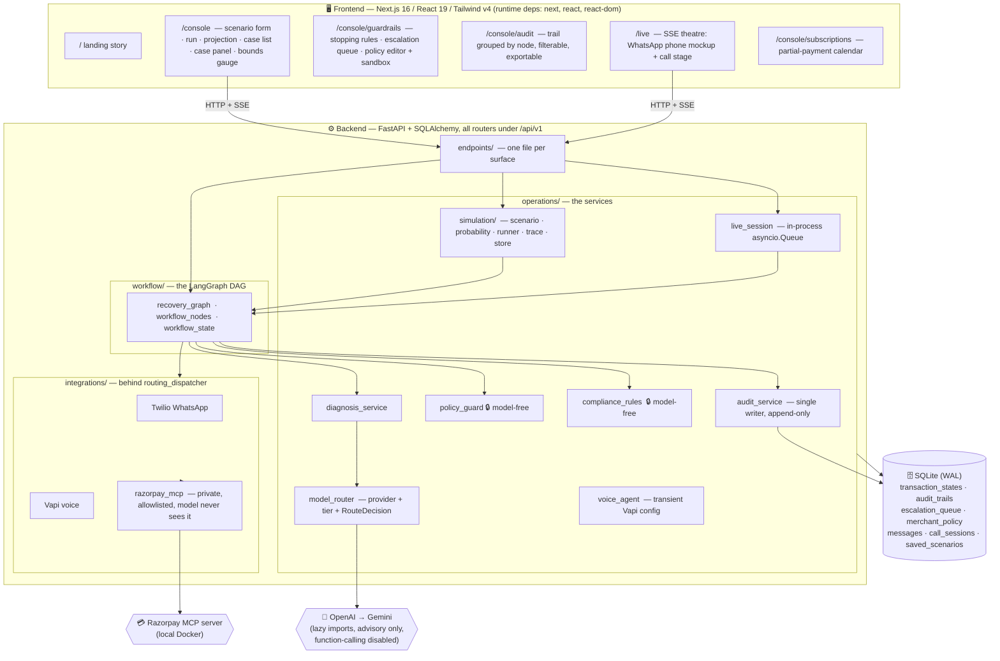

**Entry point:** `uvicorn application.server:app` (not `main.py`, which is vestigial). Startup runs `init_db()` → `create_all`, prunes old simulation and live-session rows, and launches the deadline sweeper.

---

## 🔀 The recovery decision graph

`workflow/recovery_graph.py` builds a `StateGraph` over `RecoveryState`, with `OrchestratorDeps {db, diagnosis, sandbox, dispatch, clock}` **injected** so it is fully testable offline.

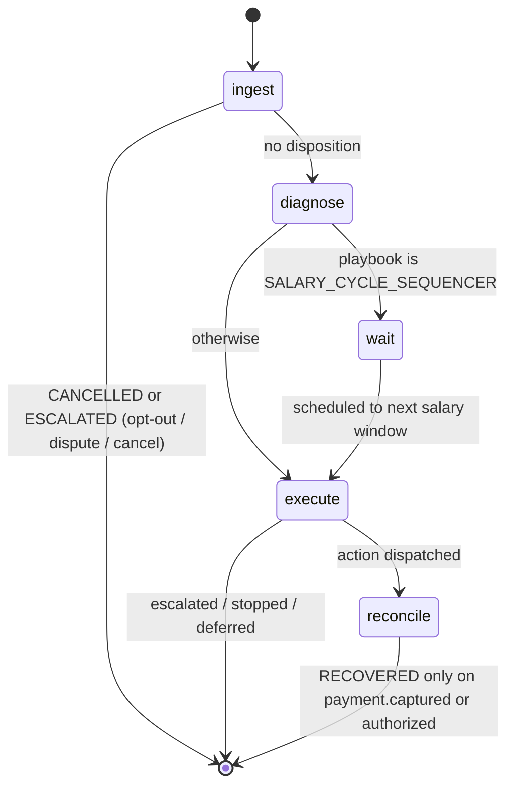

| Node | What it does |
|------|-------------|
| **`ingest`** | Sets `DIAGNOSING`. Runs `screen_user_message()` on any customer message **before the model sees it** — so an opt-out or dispute cannot be overridden by the LLM. `TERMINATE → CANCELLED`; `ESCALATE →` escalation ticket + `ESCALATED`. |
| **`diagnose`** | Calls the diagnosis engine, audits `{root_cause, recommended_playbook, confidence}`. An unknown playbook string is coerced to the class default — LLM output is advisory. |
| **`wait`** | `SALARY_CYCLE_SEQUENCER` only. Schedules to `helpers.next_salary_window()`, audits `RETRY_SCHEDULED`. |
| **`execute`** | Resolves playbook → action, runs the compliance gates **(quiet hours → retry cap → voice cap)**, builds a `ProposedAction`, calls `sandbox.validate()`. **A rejected action is never dispatched — it escalates to a human.** |
| **`reconcile`** | Only `payment.captured` / `payment.authorized` close a case as `RECOVERED`. Anything else logs `AWAITING_OUTCOME` and leaves it open. |

---

## 🛑 Guardrails & stopping rules (the spine)

Eight named rules (`constants.StoppingRule`). They are **not** all enforced in the same place:

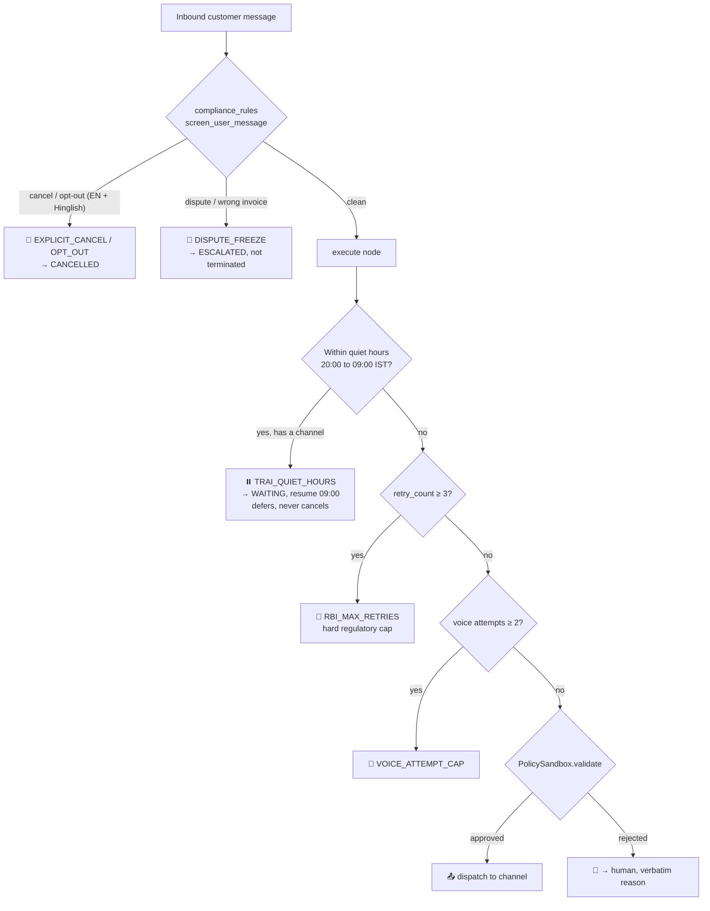

| Rule | Enforced in | Behaviour |
|------|-------------|-----------|
| `EXPLICIT_CANCEL` | `screen_user_message()` → `ingest` | Terminate → `CANCELLED` |
| `OPT_OUT` | same | Terminate → `CANCELLED` (beats dispute — ceasing contact is the safer instruction) |
| `DISPUTE_FREEZE` | same | **Escalate**, not terminate |
| `RBI_MAX_RETRIES` = 3 | `retry_cap_exceeded()` → `execute` | Hard cap. Not a design choice — a regulation. |
| `TRAI_QUIET_HOURS` 20:00–09:00 IST | `is_within_quiet_hours()` → `execute` | **Defers** (`WAITING` + `RETRY_SCHEDULED` audit). A channel-less auto-debit retry is exempt — TRAI governs outbound *contact*. |
| `VOICE_ATTEMPT_CAP` = 2 | `voice_attempts_exhausted()` → `execute` | Stop voice, consider handoff |
| `NO_DOUBLE_CHARGE` | seeded outcome | e.g. late settlement lands before a retry |
| `CROSS_DEVICE_COMPLETION` | seeded outcome | customer paid on another device |

> **Precedence is identical on both sides of the wire.** `compliance_rules.py` (Python) and `Frontend/src/lib/bounds.ts` (TypeScript) mirror each other: `RBI_MAX_RETRIES=3`, `VOICE_ATTEMPT_CAP=2`, `QUIET_HOURS_START=20`, `QUIET_HOURS_END=9`. Change one, change the other.

Escalation is a **success of the guardrails, not a failure.**

---

## 🔒 The model-free boundary

Two files are load-bearing for the entire product claim and must stay deterministic:

### `operations/policy_guard.py` — `PolicySandbox.validate()`

The **single gate** every outbound action passes. Checks, in order:
1. Action is in the policy's `allowed_actions`
2. Channel is in `allowed_channels`
3. Partial-payment rules (`allow_partial_payment`, `min_partial_payment_pct`)
4. `discount_pct` ≤ `max_discount_pct`
5. For money-moving actions only (`GENERATE_PAYMENT_LINK`, `RETRY_CHARGE`, `OFFER_FEE_WAIVER`, `GENERATE_QR_CODE`, `OFFER_PARTIAL_PLAN`): `amount_minor` ≤ `max_intervention_amount_minor`

`Decision.reason` strings are **user-facing copy** — surfaced verbatim, never rewritten by a model.

### `operations/compliance_rules.py`

Deterministic phrase matching (EN + Hinglish) for cancel / opt-out / dispute, plus the numeric caps. Cancel and opt-out beat dispute.

### The editable policy is one row

`merchant_policy` is a **single row** (`id=1`). Only a human operator writes it — **the conversational layer has no path to it**, which is exactly what keeps the guardrails un-negotiable by the model. A simulation builds a scenario-scoped `PolicySandbox` in memory instead of touching that row.

---

## 🤖 The cost-aware LLM router

`operations/model_router.py` — small and explicit. It owns *tier selection* and *provider failover*; the recovery engine still owns every consequential decision.

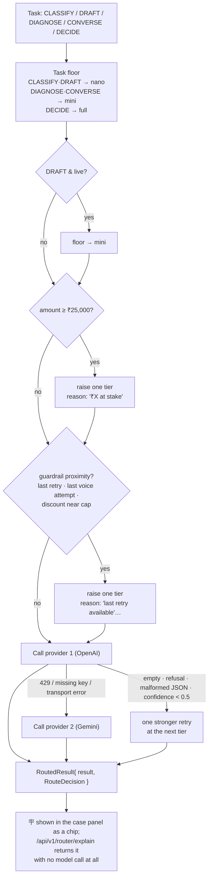

| Call site | Task | Batch model | Live model | Deterministic fallback |
|-----------|------|-------------|------------|------------------------|
| `diagnosis_service` | `DIAGNOSE` | mini, JSON mode | mini | class default playbook, `root_cause="UNDIAGNOSED"`, confidence 0.0 |
| `message_drafter` | `DRAFT` | **nano** | mini | hardcoded EN/HI template |
| `assistant_service` | `DECIDE` | full, JSON mode | full | `_fallback_parse()` — pure keyword matching, EN + Hindi |

- **Both SDKs are lazy imports.** A missing key, missing SDK, 429, or transport error never takes down the API.
- **Function calling is explicitly disabled.** There are no tool definitions handed to any model.
- **Batch paths pass `generate=None` deliberately** — N cases × one model call each is the dominant cost and latency, and will hit rate limits mid-demo. Template drafting instead.
- Every routed response carries a `RouteDecision` with a plain-language `reason` — *"₹48,000 at stake → raised to full · gpt-5.4"*, *"OpenAI unavailable → Gemini"*.

---

## 🧪 The simulation engine (the console produces money, it doesn't report it)

`application/simulation/` — the operator supplies a scenario, presses Run, and N cases stream through the **real LangGraph** concurrently.

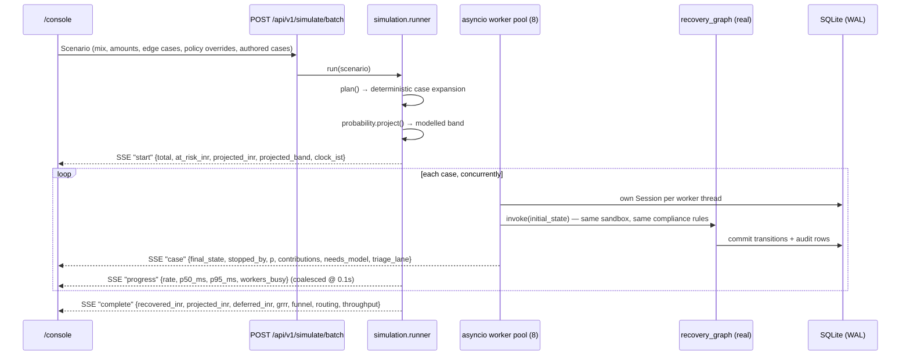

**Why it's built this way**
- **The backend is the only source of a decision's "why".** The simulator drives the real engine through an endpoint rather than reimplementing the rules in TypeScript — a second implementation would drift, and the whole claim is that the reason on screen is production code.
- **Isolation.** Simulated cases carry `metadata_json.simulation_run_id`. `compute_metrics` and `list_transactions` exclude them by default. *Verified: four full runs left `GET /metrics` byte-identical.*
- **Concurrency.** A SQLAlchemy Session isn't thread-safe and every graph node commits — so each case gets its own Session, opened and closed inside the worker; the graph runs in a worker thread via `to_thread`; SQLite runs in WAL with a busy timeout. *(Bonus: the test suite went from 228s → 37s.)*
- **Authored cases.** Scenarios accept operator-written cases alongside generated ones. A typed Hinglish opt-out flows through the same `screen_user_message()` ingest gate — so it's a real `OPT_OUT` decision, not a special case.
- **Scenario percentages can never rewrite an authored case.** Settlement quirks are apportioned across *generated* cases only.
- **The batch answers "how many need the LLM?" without making the calls.** `application/simulation/triage.py` scores every planned case against the same raisers the `model_router` uses (stakes ≥ ₹25k, guardrail proximity) plus two ambiguity signals — a free-text reply the deterministic screen can't classify, and a failure class with no machine telemetry. The `complete` event's `routing` block reports `llm` (advisory-call candidates, an overlap) alongside the mutually-exclusive outcome lanes `closed · human · postponed · in_flight`, and `model_calls_saved` — the per-case LLM calls this offline run avoided against production. A month-end mandate crunch routes ~0% to the model; an aged B2B book routes ~90%.

**Measured:** 200 cases in ~3.1s · ~65 cases/sec · p95 ~280ms · 8 workers.

Endpoints: `POST /simulate/batch` (SSE) · `GET /simulate/scenarios` · `GET|DELETE /simulate/runs/{id}` · `POST /simulate/prune` · `GET/POST/DELETE /simulate/scenarios` (saved-scenario CRUD, versioned base64url share links).

---

## 📈 The projection model (measured / projected / deferred)

`application/simulation/probability.py` — closed form, pure stdlib, runs per-case inside the worker pool.

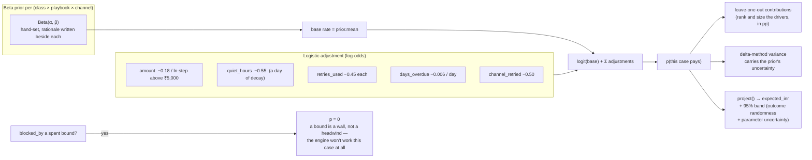

The three figures in the `complete` event are **not additive and must not be summed**:

| Figure | Meaning | Source |
|--------|---------|--------|
| 💚 **`recovered_inr`** | rupee value of cases the engine *actually* drove to `RECOVERED` in this run | measured |
| 🔵 **`projected_inr`** + `[low, high]` | expected value across the whole book, with a 95% band | modelled — *never presented as money that moved* |
| ⏸️ **`deferred_inr`** | cases in `WAITING` because of quiet hours — neither recovered nor lost | measured |

> **Lessons baked in** *(from the decisions log)*: a cooperative customer reply must **not guarantee** payment (settlement is drawn against the model's own probability, seeded deterministically so two runs stay comparable); a spent bound **zeroes** the projection, it doesn't merely penalise it. GRRR now lands between **4.8% and 29%** depending on the scenario — and the guardrails are what move it.

`observed_posteriors()` folds real completed, non-simulated outcomes back into the priors: the more the engine runs, the less the hand-set number matters.

> There is also a **second, deliberately opposite** model — `operations/repayment_model.py` — a tiny logistic regression fit by actual gradient descent at import time, so the demo can show a *learned* decision surface and feature weights. It's a demo of a learned model, not the projection engine.

---

## 🎭 The live theatre (SSE)

`/live` turns the claim into a watchable demo. `operations/live_session.py` coordinates one in-process `asyncio.Queue` per session (single-worker by design — the durable transaction/message/call/escalation/audit rows remain the record).

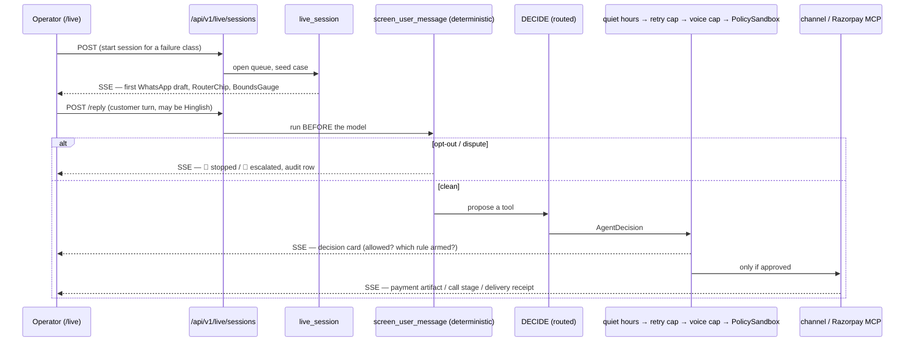

Every human turn runs `screen_user_message()` **ahead of the model** so opt-outs and disputes cannot be overridden by an LLM. The customer's side is scripted; the engine's decisions are real code — the README, the UI, and the code all say so.

---

## 📞 Hinglish voice recovery

- `operations/voice_agent.py` builds a **transient Vapi assistant config per call**, personalised with the customer's name, amount, failure-class script opening, *and live guardrail state* — discount cap, voice attempts remaining.
- Provider maps through the same router (`google` ↔ `openai`), full tier.
- `conversation_service.build_call()` supplies the scripted beats; `speech_format.speakable()` renders numbers and currency for TTS.
- Voice is capped at **2 attempts** (`VOICE_ATTEMPT_CAP`) — a stopping rule, counted in the metrics like every other.
- Integrations: **Vapi** (web + telephony) and **ElevenLabs** (TTS), Hindi + English.

---

## 💳 The private Razorpay MCP

`integrations/razorpay_mcp.py` — the payment dispatch transport.

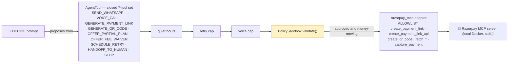

> **Central invariant:** the model **never sees the MCP tool list**, and no MCP tool name may appear in a `DECIDE` prompt or reach `AgentTool`. The MCP SDK is a lazy import; the connection is process-local. `SCHEDULE_RETRY`, `HANDOFF_TO_HUMAN`, and `STOP` are *dispositions* — they never dispatch, which is why `AgentTool` is its own enum separate from `InterventionAction`.

Config: `.Agents/mcp.json` runs `razorpay-mcp-server:latest` in Docker. Webhooks land at `POST /api/v1/webhooks/razorpay` with `processed_events` idempotency.

> 📸 This path has been exercised end to end against live Razorpay infrastructure — see [**Proof it works**](#-proof-it-works-on-real-razorpay-infrastructure) for the hosted link, the checkout, and the real `pay_…` capture.


---

## 📒 The audit trail

`entities/audit_record.py` → `audit_trails`, **append-only**: `before_update` / `before_delete` SQLAlchemy listeners raise on any attempt to mutate history.

- **Single writer:** `operations/audit_service.py::record_audit()`.
- Reasoning captured as **structured payload**, not prose — `{root_cause, recommended_playbook, confidence}`, `{rule, resume_at}`, `{channel, action, sandbox_reason}`.
- `/console/audit` groups the trail by DAG node (`INGEST`, `DIAGNOSE`, `WAIT`, `EXECUTE_INTERVENTION`, `RECONCILE`, `OPERATOR`), filterable and exportable to CSV.
- `compute_metrics()` derives *everything* on read — nothing is stored. Stopping rules are counted from audit payloads **and** ticket rules separately (an `EscalationQueue.rule` is nullable).

---

## 🖥 Frontend: make the money undeniable

Next.js 16.3 App Router · React 19.2 · TypeScript strict · Tailwind v4 (CSS-first, no config file). **Runtime UI dependencies: `next`, `react`, `react-dom`** — plus `framer-motion` and `@vapi-ai/web` for the theatre. No shadcn, no Radix, no icon library.

**Four routes, by design** — the temptation is a route per concept; the discipline is fewer, denser places so the proof gets *found*:

| Route | Purpose |
|-------|---------|
| `/` | Meena & Shashank's story — the human "why", papery light theme scoped to the route |
| `/console` | Scenario form + one-click presets → run progress → projection panel → case list (filterable) → case detail sheet with **bounds gauge**, decision trace, probability breakdown, conversation, audit timeline |
| `/console/guardrails` | Stopping rules, escalation queue, policy editor + live sandbox |
| `/console/audit` | Audit trail grouped by node, filterable, exportable |
| `/live` | The SSE theatre (WhatsApp phone mockup + call stage) |
| `/console/subscriptions` | Partial-payment / due-payment calendar from the merchant's side |

**Experience pillars:** the number leads (`recovered_inr` at display size, above the fold) · one sentence does the pitch · **restraint is the feature** (the bounds gauge is the single most differentiating component) · show the work happening · calm, dense, honest — *"a tool someone uses on a Tuesday, not a pitch deck."*

**Unit discipline:** `amount_inr` is rupees; `*_minor` is paise. Converted once, at the boundary, in `lib/format.ts`.

---

## 🔌 API surface

All routers mount under `/api/v1`.

<details>
<summary><b>Full endpoint list</b></summary>

| Area | Endpoints |
|------|-----------|
| **Health** | `GET /health` |
| **Metrics** | `GET /metrics` · `GET /escalations` · `POST /escalations/{ticket_id}/resolve` |
| **Transactions** | `GET /transactions` · `GET /transactions/{id}` · `GET /transactions/{id}/conversation` · `GET /transactions/{id}/calls` · `POST /transactions/{id}/call/start` · `POST /transactions/{id}/messages` · `POST /transactions/{id}/messages/draft` · `POST /transactions/{id}/payment-link` · `GET /transactions/{id}/payment-link/status` · `POST /transactions/{id}/status` · `POST /transactions/{id}/note` · `GET /transactions/{id}/run` (SSE) · `POST /transactions/simulate` · `POST /transactions/recover-batch` · `GET /audit` |
| **Simulation** | `POST /simulate/batch` (SSE) · `GET /simulate/scenarios` · `POST /simulate/scenarios` · `DELETE /simulate/scenarios/{slug}` · `GET /simulate/runs` · `GET|DELETE /simulate/runs/{run_id}` · `POST /simulate/prune` |
| **Live** | `POST /live/sessions` · `GET /live/sessions/{id}/stream` (SSE) · `POST /live/sessions/{id}/reply` · `POST /live/sessions/{id}/call/web` · `POST /live/sessions/{id}/turns` · `POST /live/sessions/{id}/agent/tool` · `GET /live/sessions/{id}/artifacts` · `POST /live/sessions/{id}/artifacts/check-status` · `POST /live/sessions/{id}/artifacts/{artifact_id}/simulate-pay` · `DELETE /live/sessions/{id}` |
| **Policy** | `GET /policy` · `PATCH /policy` · `POST /policy/validate` · `POST /policy/screen` |
| **Router** | `POST /router/explain` (pure — no model call) |
| **Repayment model** | `POST /repayment/predict` · `GET /repayment/model` |
| **Trackers** | `GET|POST /subscriptions` · `GET|POST /invoices` |
| **Assistant** | `POST /assistant/chat` · `POST /assistant/tts` |
| **Stream** | `GET /stream/demo/{failure_class}` (SSE) |
| **Webhooks** | `POST /webhooks/razorpay` |
| **Admin** | `POST /admin/seed` 🔒 truncates every table — requires `X-Admin-Token`, disabled unless `ADMIN_TOKEN` is set |

</details>

Interactive docs at `http://localhost:8000/docs` — or live at <https://recova-production-4531.up.railway.app/docs>.

> 🔒 **`POST /admin/seed` truncates every table**, bypassing the append-only audit guards via bulk delete. It is gated behind `ADMIN_TOKEN` and **fails closed**: with the variable unset the route returns `404` rather than running, so a deployment that forgets it loses its reset button instead of handing that button to the internet. With the variable set, the request must carry a matching `X-Admin-Token` header, compared in constant time. No client calls it — it is an operator's `curl`, never a button in a browser.

---

## 🧰 Tech stack

| Layer | Choices |
|-------|---------|
| **Orchestration** | LangGraph 1.2 `StateGraph` · injected `OrchestratorDeps` (db, diagnosis, sandbox, dispatch, clock) |
| **Backend** | FastAPI 0.141 · SQLAlchemy 2.0 · Pydantic 2.13 · Uvicorn · `uv` |
| **Storage** | SQLite in **WAL** mode (`recovery_engine.db`), created on startup · `cryptography` Fernet for `customer_contact` (`protection.EncryptedString`) |
| **LLM** | OpenAI (`openai>=3.8`) → Google Gemini (`google-genai 2.20`) fallback · both lazy imports · function calling disabled |
| **Payments** | `razorpay 2.0` · private MCP server via `mcp>=1.12` over Docker/stdio |
| **Voice** | Twilio 9.11 (WhatsApp) · Vapi · ElevenLabs — Hindi + English |
| **Frontend** | Next.js 16.3 (App Router, typed routes) · React 19.2 · TypeScript strict · Tailwind v4 (CSS-first) · Framer Motion · `@vapi-ai/web` |
| **Tests** | `pytest` (47 backend test files, **377 passing in ~58s**, almost all offline) · `vitest` (frontend) |

---

## 🚀 Getting started

> **You don't have to.** The console is live at <https://recova-v1.vercel.app/console> and the API at <https://recova-production-4531.up.railway.app/docs>. Run it locally only if you want to read the engine work.

### Prerequisites
- Python **3.12+**, Node.js **20.9+**, npm
- [`uv`](https://docs.astral.sh/uv/) (recommended for the backend)
- Docker (only if you want the live Razorpay MCP)

### 1. Backend

```bash
cd Backend
uv sync
uv run uvicorn application.server:app --reload --port 8000
```

API at <http://localhost:8000> · docs at <http://localhost:8000/docs>. SQLite `Backend/recovery_engine.db` is created on first run.

<details>
<summary>Without <code>uv</code> (pip + venv)</summary>

```bash
python3 -m venv .venv && source .venv/bin/activate
python -m pip install -r Backend/dependencies.txt
cd Backend
python -m uvicorn application.server:app --reload --port 8000
```
</details>

### 2. Frontend

```bash
cd Frontend
npm ci
cp .env.example .env.local
npm run dev
```

Dashboard at <http://localhost:3000>. Point `NEXT_PUBLIC_API_BASE` in `.env.local` at another backend if needed.

### 3. Seed a demo batch (optional)

You almost certainly don't need this — open `/console`, pick a sample scenario, and press **Run**. The run drives the real LangGraph and writes genuine audit rows, so `/console/audit` fills from it; `/console/guardrails` reads the policy row that startup creates from `merchant_rules.json`.

If you do want a stored book to look at, the seeder is an operator route, not a UI button:

```bash
# Backend/.env
ADMIN_TOKEN=pick-something-long

curl -X POST http://localhost:8000/api/v1/admin/seed -H "X-Admin-Token: pick-something-long"
```

Seeded at-risk cases are pushed through the **real LangGraph**, so their audit trails are genuine. Leave `ADMIN_TOKEN` unset and the route stays disabled.

### Environment variables

Runs locally on built-in defaults. Add to `Backend/.env` when you need providers:

| Var | For |
|-----|-----|
| `GEMINI_API_KEY` / `OPENAI_API_KEY` | LLM router (either works; both optional) |
| `RAZORPAY_KEY_ID`, `RAZORPAY_KEY_SECRET`, `RAZORPAY_WEBHOOK_SECRET` | Razorpay + MCP |
| `ELEVENLABS_API_KEY`, `VAPI_API_KEY` | Voice |
| `TWILIO_ACCOUNT_SID`, `TWILIO_AUTH_TOKEN`, `TWILIO_API_KEY_SID`, `TWILIO_API_KEY_SECRET` | WhatsApp |
| `ENCRYPTION_KEY`, `LIVE_MODE` | Fernet key + whether channels actually dispatch |
| `ADMIN_TOKEN` | Enables `POST /admin/seed` and the header it demands. Unset = route disabled |

Keep secrets out of source control.

---

## ✅ Testing

```bash
cd Backend
uv run pytest          # 377 passing in ~58s, almost all offline (no network, fixed clock)
```

```bash
cd Frontend
npm test               # vitest
```

The suite pins a fixed mid-morning IST clock — without it, tests would start failing at 20:00 (quiet hours) and the seeder would produce a time-dependent batch.

---

## 📁 Repo layout

```
Recova/
├── Backend/                      FastAPI + SQLAlchemy + LangGraph · SQLite · uv
│   ├── application/
│   │   ├── server.py             ← entry point (NOT main.py)
│   │   ├── constants.py          domain enums: FailureClass, StoppingRule, Playbook…
│   │   ├── endpoints/            one router file per surface
│   │   ├── entities/             SQLAlchemy ORM models
│   │   ├── workflow/             the LangGraph DAG — recovery_graph · workflow_nodes · workflow_state
│   │   ├── operations/           the services (everything interesting)
│   │   │   ├── model_router.py       provider + tier + RouteDecision
│   │   │   ├── policy_guard.py       🔒 model-free sandbox
│   │   │   ├── compliance_rules.py   🔒 model-free stopping rules
│   │   │   ├── diagnosis_service.py · message_drafter.py · assistant_service.py
│   │   │   ├── agent_tools.py        closed AgentTool set + deterministic gates
│   │   │   ├── batch_seed.py         the demo engine (real graph, genuine audits)
│   │   │   ├── live_session.py       interactive theatre (in-process queue)
│   │   │   ├── voice_agent.py        transient Vapi configs
│   │   │   └── repayment_model.py    a demo learned model (logistic regression)
│   │   ├── simulation/           scenario · probability · runner · trace · store
│   │   ├── integrations/         Twilio · Vapi · razorpay_mcp (behind routing_dispatcher)
│   │   └── configuration/        merchant_rules.json — the default policy
│   ├── test_suite/               47 pytest files · 377 passing
│   └── railway.json              backend deploy config
├── Frontend/                     Next.js 16.3 · React 19 · Tailwind v4
│   ├── src/app/                  landing · console · console/{guardrails,audit,subscriptions} · live
│   ├── src/components/           console/ · sim/ · live/ · story/
│   ├── src/lib/                  api · types · format · bounds (mirrors compliance_rules) · i18n/
│   └── src/hooks/                useApi · useSimulationRun · useLiveSession
├── docs/proof/                   the real Razorpay capture, screenshotted
├── .Agents/                      agent-facing docs, problem statement, mcp.json
├── Progress.md                   living status + decisions log (read this)
├── LICENSE                       MIT
└── README.md                     you are here
```

---

<div align="center">

**Recova** — *detect · diagnose · intervene · bound · escalate · stop · audit · measure.*

Any system can send more messages. Ours knows when to stop.

</div>
